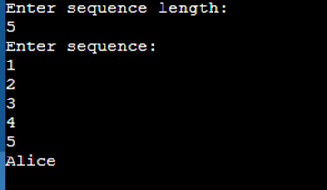

Problem Solving Assignment

Problem statement : Alice and Bob are playing a game on a sequence a1,a2,…,an of length n. They move in turns and Alice moves first. In the turn of each player, he or she should select an integer and remove it from the sequence. The game ends when there is no integer left in the sequence. Alice wins if the sum of her selected integers is even; otherwise, Bob wins. Your task is to determine who will win the game, if both players play optimally.

1.Problem Identification

The problem involves determining the winner of a game based on a sequence of integers. The rules to determine the winner are 
-	Alice should start first
-	The game ends when there is no integer left in the sequence
-	Alice wins if the sum of her selected integers is even, otherwise Bob wins.

2. Decomposition

 We decompose the problem into below functions 
- Main function : 
●	Reads the length of the sequence and the sequence itself.
●	Calls the determineWinner function to find the winner based on the sequence.
●	Prints the winner.
- determineWinner function : 
●	Counts the number of even and odd integers in the given sequence.
●	Applies certain conditions to determine the winner (Bob or Alice) based on the counts of even and odd integers.

3. Pattern Recognition

The function determineWinner identifies a pattern in the counts of even and odd numbers to determine the winner. The conditions check for specific combinations of even and odd counts to declare the winner.
Example :
1.	 n=5 and sequence = [1,1,1,1,1] , so here the odd count is 5 , as Alice starts the game first he ends up with odd sum (1+1+1=3 )  , so in this case Bob wins.
2.	 n= 6 and sequence =[1,1,1,1,1,1] , so even here as Alice starts first , he ends up with odd sum (1+1+1=3) , so in this case also Bob wins.
3.	n=3 and sequence = [1,1,1] , so here odd count is 3 and as Alice starts the game first he ends up with even sum (1+1=2) , so Alice wins 
4.	n= 4 and sequence=[1,3,5,7] , odd count is 4 and as Alice starts first he ends up with getting even sum (1+3 or 1+5 or 1+ 7 or any other combination) , so Alice wins.
5.	n=4 and sequence =[1,2,3,4] , so here odd count =2 and even count =2 , as Alice starts first he ends up getting odd sum as they both play optimally , so Bob wins 
-so the pattern i recognized is that if ((oddCount%4==1 && evenCount%2==0)||(oddCount%4==2)) , then Bob wins the game else Alice wins the game.

4. Abstraction

I think we can completely neglect the case where all the given numbers in the sequence are even numbers as in that case definitely Alice wins the game , to know the performance of the code it is better to neglect this type of examples.

5. Algorithm

●	Initialize counters for even and odd numbers.
●	Iterate through the sequence:
○	Increment the respective counter based on whether the number is even or odd.
●	Determine the winner based on the counts:
○	If the count of odd numbers modulo 4 is 1 and the count of even numbers modulo 2 is 0, or if the count of odd numbers modulo 4 is 2, Bob wins.
○	Otherwise, Alice wins.

6. Pseudo Code
function determineWinner(sequence):
    evenCount = 0 
    oddCount = 0 
    for num in sequence:
        if num is even:
            increment evenCount
        else:
            increment oddCount

    if (oddCount% 4 == 1 and evenCount % 2 == 0) or oddCount % 4 == 2:
        return "Bob"
    else:
        return "Alice"

function main():
    n = readInt() // Length of sequence
    sequence = readIntArray(n) 
    winner = determineWinner(sequence) 
    print(winner) 

7. Code
import java.util.*;
public class Main {
    public static String determineWinner(int[] sequence) {
        int evenCount = 0, oddCount = 0; 
        for (int num : sequence) {
            if (num % 2 == 0) {
                evenCount++;
            } else {
                oddCount++;
            }
        }

        if ((oddCount % 4 == 1 && evenCount % 2 == 0) || oddCount % 4 == 2) {
            return "Bob";
        }

        return "Alice";
    }

    public static void main(String[] args) {
        Scanner scanner = new Scanner(System.in);
        System.out.println("Enter sequence length:");
        int n = scanner.nextInt(); 
        int[] sequence = new int[n]; 
        System.out.println("Enter sequence:");
        for (int j = 0; j < n; j++) {
             sequence[j] = scanner.nextInt(); 
        }
        String winner = determineWinner(sequence);
        System.out.println(winner);
    }
}

Output : 

 

